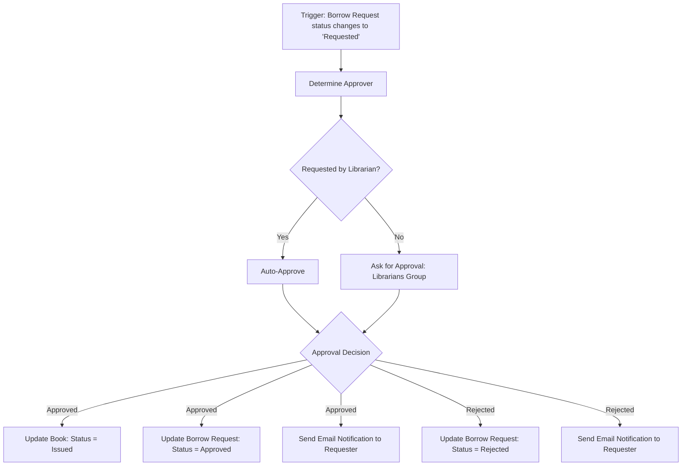

# Technical Blueprint: Smart Library Request Workflow

This blueprint defines the database tables, fields, access controls, flows, UI policies, and reports for implementing the Smart Library Request Workflow in ServiceNow.

---

## 1. Database Schema

### 1.1 Book Table (`u_book`)
Tracks the library's physical catalog and current book availability.

| Field Label | Database Column | Data Type | Choice/Reference Details | Default Value | Mandatory |
|---|---|---|---|---|---|
| Title | `u_title` | String (100) | - | - | Yes |
| Author | `u_author` | String (100) | - | - | Yes |
| ISBN | `u_isbn` | String (20) | - | - | No |
| Status | `u_status` | Choice | - **Available** (`available`)  - **Issued** (`issued`)  - **Lost** (`lost`) | `available` | Yes |

### 1.2 Borrow Request Table (`u_borrow_request`)
Manages book request transactions, approvals, and status tracking.

| Field Label | Database Column | Data Type | Choice/Reference Details | Default Value | Mandatory |
|---|---|---|---|---|---|
| Requested By | `u_requested_by` | Reference | Points to User Table (`sys_user`) | Dynamic: Current User | Yes |
| Book | `u_book` | Reference | Points to Book Table (`u_book`) | - | Yes |
| Request Date | `u_request_date` | Date | - | Dynamic: Current Date | Yes |
| Return Date | `u_return_date` | Date | - | - | Conditional (Mandatory when status is Issued) |
| Status | `u_status` | Choice | - **Requested** (`requested`)  - **Approved** (`approved`)  - **Rejected** (`rejected`)  - **Returned** (`returned`) | `requested` | Yes |

---

## 2. Table Relationships
- **Borrow Request -> Book** (`u_borrow_request.u_book`): Many-to-One reference to `u_book`.
- **Related List on Book Form**: Displays all Borrow Requests referencing the specific book (`u_borrow_request.u_book`).

---

## 3. Data Integrity & Validation Rules

### 3.1 Reference Qualifier (Book Field)
Prevents students from selecting books that are already checked out or lost.
- **Applied to**: `u_borrow_request.u_book` field.
- **Reference Qualifier Type**: Simple
- **Condition Filter**: `u_status=available`

### 3.2 UI Policy (Form Restrictions)
Locks down fields to prevent accidental edits once the borrowing has been approved or the book has been issued.
- **UI Policy Name**: Make Return Date mandatory when Issued
- **Table**: `u_borrow_request`
- **Conditions**: `Status` is `Approved` OR `Status` is `Issued`
- **UI Policy Actions**:
  - `u_return_date` -> Mandatory: **True**, Visible: **True**
  - `u_book` -> Read-only: **True**
  - `u_requested_by` -> Read-only: **True**
  - `u_request_date` -> Read-only: **True**

---

## 4. Access Control Rules (ACL Matrix)

Role-based access controls (ACLs) restrict operations on tables to maintain system security.
- **Student Role (`student`)**: Has permissions to browse the catalog and submit/track their own requests.
- **Librarian Role (`librarian`)**: Has complete access to manage the catalog, review requests, and execute returns.

| Table | Operation | Requires Role | Description / Advanced Condition |
|---|---|---|---|
| `u_book` | `read` | `student`, `librarian` | Anyone can browse the catalog. |
| `u_book` | `create` | `librarian` | Only librarians can add books. |
| `u_book` | `write` | `librarian` | Only librarians can modify book details. |
| `u_book` | `delete` | `librarian` | Only librarians can delete catalog items. |
| `u_borrow_request` | `create` | `student` | Only students can initiate request tickets. |
| `u_borrow_request` | `read` | `student`, `librarian` | Librarians can read all. Students can only read their own requests (Condition: `u_requested_by=javascript:gs.getUserID()`). |
| `u_borrow_request` | `write` | `librarian` | Only librarians can update/approve requests. |
| `u_borrow_request` | `delete` | `librarian` | Only librarians can delete requests. |

---

## 5. Flow Designer Workflow (Borrow Request Approval Flow)

Automates the transaction flow from request submission to approval, issuance, and notification.

### Flow Configuration Details:
1. **Trigger**:
   - Table: Borrow Request (`u_borrow_request`)
   - Condition: `Status` changes to `Requested`
2. **Approval Step**:
   - Action: `Ask For Approval`
   - Approver: Users with `librarian` role (or Group: `Librarians`)
   - Rules:
     - Approved: Approve when anyone approves.
     - Rejected: Reject when anyone rejects.
3. **If Approved Branch**:
   - **Action 1 (Update Book)**:
     - Table: Book (`u_book`)
     - Record: `Trigger.Book`
     - Fields: `Status` = `Issued`
   - **Action 2 (Update Request)**:
     - Table: Borrow Request (`u_borrow_request`)
     - Record: `Trigger`
     - Fields: `Status` = `Approved`
   - **Action 3 (Send Email)**:
     - To: `Trigger.Requested By`
     - Subject: "Your Borrow Request has been Approved"
     - Body: "The book [Book.Title] has been issued to you. Please collect it from the library."
4. **If Rejected Branch**:
   - **Action 1 (Update Request)**:
     - Record: `Trigger`
     - Fields: `Status` = `Rejected`
   - **Action 2 (Send Email)**:
     - To: `Trigger.Requested By`
     - Subject: "Your Borrow Request has been Rejected"
     - Body: "We regret to inform you that your request for [Book.Title] has been rejected."

---

## 6. Report Specifications

### "Most Borrowed Books" Report
Identifies catalog usage trends.
- **Source Type**: Table
- **Table**: Borrow Request (`u_borrow_request`)
- **Type**: Vertical Bar Chart
- **Group By**: `Book` (`u_book`)
- **Aggregate**: Count
- **Filter**: `Status` is `Approved` OR `Status` is `Returned`
- **Top Limit**: Display Top 5
- **Sharing**: Read access shared with roles `librarian` and `student`.
